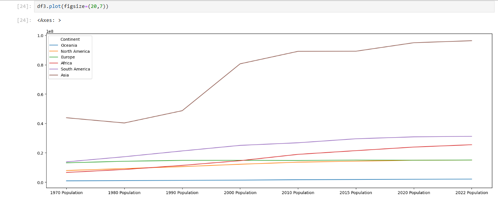

# pythonProjects
**Data Cleaning & Exploratory Data Analysis with Pandas**

This repository demonstrates a complete **Data Analysis workflow** using **Python & Pandas**.

It covers two essential steps in any data science project:

**1. Data Cleaning** - preparing raw data for analysis

**2. Exploratory Data Analysis(EDA)** - exploring patterns, trends and insights

---

**Files Included**

- `Data_cleaning_pandas.ipynb` - Cleaning customer call list dataset
- `EDA with Pandas.ipynb` - Exploratory analysis on world population dataset

---

**Tools & Libraries Used**

- Python 3.x
- Pandas 
- NumPy
- Matplotlib
- Seaborn

---

**Workflow** 

**1. Data Cleaning**(`Data_cleaning_pandas.ipynb`)

- Removed duplicates
- Dropped irrelevant columns
- Standardized column values
- Cleaned string data(`Last_Name`,`Phone_Number`,etc.) using regex and string functions
- Prepared dataset for further analysis

**Before Cleaning**

**After Cleaning**

**2. Exploratory Data Analysis**(`EDA with Pandas.ipynb`)

- Loaded `World Population dataset`
- Performed dataset overview: `.head()`,`.info()`,`.describe()`
- Checked missing values & unique values
- Analyzed top populated countries
- Explored population growth ,density, and world percentage

**Top 5 Countries by Population(2022)**

**Population Growth Trend**

---

**Key Insights**

- Cleaning ensures **consistency & accuracy** of data before analysis 
- EDA highlights **population trends** and shows how data-driven decisions can be made
- Combines practical data wrangling with statistical exploration
